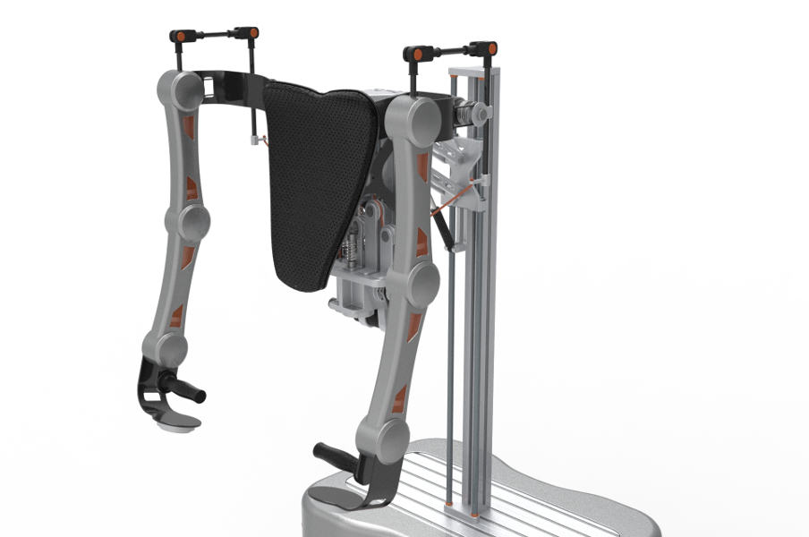

# COE CORE #

The package has been developed within the scope of the project [EURECA](www.cleansky-eureca.eu/), funnded from the [Clean Sky](www.cleansky.eu) Joint Undertaking under the [European Union’s Horizon 2020]](https://ec.europa.eu/programmes/horizon2020/)  research and innovation programme under grant agreement nº 738039

> _The EURECA project framework is dedicated to innovate the assembly of aircraft interiors using advanced human-robot collaborative solutions. A pool of devices/frameworks will be deployed for teaming up with human operators in a human-centred assistive environment. The main benefits are the substantial improvement of ergonomics in workloads, the increase in the usability level of assembly actions, the digitalization of procedures with logs and visuals for error prevention through dedicated devices. Solutions are peculiarly designed for addressing both the working conditions and the management of the cabin-cargo installation process, such as limited maneuvering space, limited weight allowed on the cabin floor, reducing lead time and recurring costs. With this aim, EURECA will bring together research advancements spanning across design, manufacturing and control, robotized hardware, and software for the specific use-cases in the cabin-cargo final assembly._


### CanOpen over Ethercat ###

The CanOpen over Ethercat, [CoE](https://www.can-cia.org/fileadmin/resources/documents/proceedings/2005_rostan.pdf) hereafter, is among the most vesatile and used can in the industrial field, thanks to its intrinsic powerful architecture.  The packes should be considered as an extension with planty of utilities of the FOSS project Simple Open EtherCAT Master [SOEM](https://github.com/ros-industrial/ethercat-soem).

Tha package has been designed in order to control the new empowering collaborative robot deployed in EURECA




The package is structured in many ROS packages, and specifically:

Package Name | Description
---:|:---
	 [coe_soem_utilites](https://bitbucket.org/iras-ind/coe_soem_utilities/src/master/) | a set of functionalities that ease the development of SOEM based applciations
	 [coe_core](https://bitbucket.org/iras-ind/coe_core/src/master/) | a set of libraries that implements the most important CanOpen structures, and it provides some utilities to deploy DS402 (motor drivers) applications 
	 [coe_driver](https://bitbucket.org/iras-ind/coe_driver/src/master/) |  a ROS based node that deploys the SOEM  exploting a shared-mameory mechanism
	 [coe_hw_plugins](https://bitbucket.org/iras-ind/coe_hw_plugins/src/master/) | the plugins (based on pluginlib) that allows an easy deployment of client applications 


##coe_core Design ##

The package is the implementaiton of the most important classes to manage a CoE network:

* generic data object
* PDOs
* SDOs

In addition, a set of utilities is implemented to manage:

* errors
* finite state machines
* common objects
* mapping of most importants objects in the CoE dictionary

###Configuration ###

The package does not require any configuration, since it is designed as a set of libraries that support the developer in the deployment of a CoE application.

## Launch ##

None node is provided, and it is supposed to be just a set of utilities.


##Miscellaneous ##

###Dependencies ###

The only no-ROS dependency is [SOEM](https://github.com/OpenEtherCATsociety/SOEM).

WHile, the ROS depndenies are:

```xml
  <buildtool_depend>catkin</buildtool_depend>
  
  <!-- ROS base dependencies -->
  <build_depend>roscpp</build_depend>
  <run_depend>roscpp</run_depend>
  
  <build_depend>realtime_tools</build_depend>
  <run_depend>realtime_tools</run_depend>
  
  <build_depend>std_msgs</build_depend>
  <run_depend>std_msgs</run_depend>
  
  <build_depend>message_generation</build_depend>
  <run_depend>message_runtime</run_depend>
  
  <!-- utilities developed by CNR-ITIA to make easy the deployment of RT-applications -->
  <build_depend>realtime_utilities</build_depend>
  <run_depend>realtime_utilities</run_depend>
  
    <!-- utilities developed by CNR-ITIA to make easy the use of log files with ROS-->
   
   
   
   <!-- utilities developed by CNR-ITIA to simplify some ROS functionalities -->
  <build_depend>rosparam_utilities</build_depend>
  <run_depend>rosparam_utilities</run_depend>
```
  


  
### Contribution guidelines ###

The __coe_soem_utils__ implements a set of utilities to support the deployment of CoE application using SOEM.

### Who do I talk to? ###

* Nicola Pedrocchi, [nicola.pedrocchi@stiima.cnr.it](mailto:nicola.pedrocchi@stiima.cnr.it) 